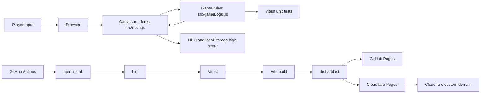

# Nebula Catcher


Nebula Catcher is a tiny browser game built as a static Vite web app. Move the ship, catch stars, avoid meteors, and try to beat your high score.


## Public deployment targets

| Target | Status | URL pattern |
| --- | --- | --- |
| GitHub Pages | Configured by `.github/workflows/pages.yml` | `https://<github-owner>.github.io/nebula-catcher-web-game/` |
| Cloudflare Pages | Configured by `.github/workflows/cloudflare-pages.yml` after Secrets are added | `https://nebula-catcher-web-game.pages.dev` |
| Cloudflare custom domain | Connect from Cloudflare Pages dashboard after project creation | Your owned Cloudflare domain |

## Game controls

- Keyboard: left/right arrows or A/D.
- Touch or mouse: tap/drag inside the game canvas.
- Start/restart: button, Space, or Enter.

## Architecture and processing flow



The app is intentionally static: no server, no database, no external runtime dependency. Production hosting only needs the generated `dist/` directory.

## Quick start

```bash
npm install
npm run dev
```

## Test and build

```bash
npm run check
```

`npm run check` executes lint, unit tests, and a Vite production build.

## CI/CD

- `.github/workflows/ci.yml`: lint, test, build, and upload the `dist` artifact.
- `.github/workflows/pages.yml`: deploys `dist` to GitHub Pages.
- `.github/workflows/cloudflare-pages.yml`: deploys `dist` to Cloudflare Pages with Wrangler Direct Upload.

## Cloudflare setup

The Cloudflare workflow requires these GitHub Actions settings:

| Type | Name | Notes |
| --- | --- | --- |
| Secret | `CLOUDFLARE_ACCOUNT_ID` | Cloudflare account ID |
| Secret | `CLOUDFLARE_API_TOKEN` | Pages deploy-capable token |
| Variable | `CLOUDFLARE_PROJECT_NAME` | Recommended: `nebula-catcher-web-game` |

After the Pages project is deployed, attach the domain you already own from **Cloudflare Dashboard > Workers & Pages > nebula-catcher-web-game > Custom domains**.

See [`docs/setup.md`](docs/setup.md) for step-by-step setup and [`docs/architecture.md`](docs/architecture.md) for the full architecture notes.

## Production requirements

- Node.js 20 for CI/build.
- Static hosting for `dist/`.
- GitHub Pages source set to GitHub Actions for the GitHub Pages URL.
- Cloudflare Secrets and custom domain connection for Cloudflare production URL.
