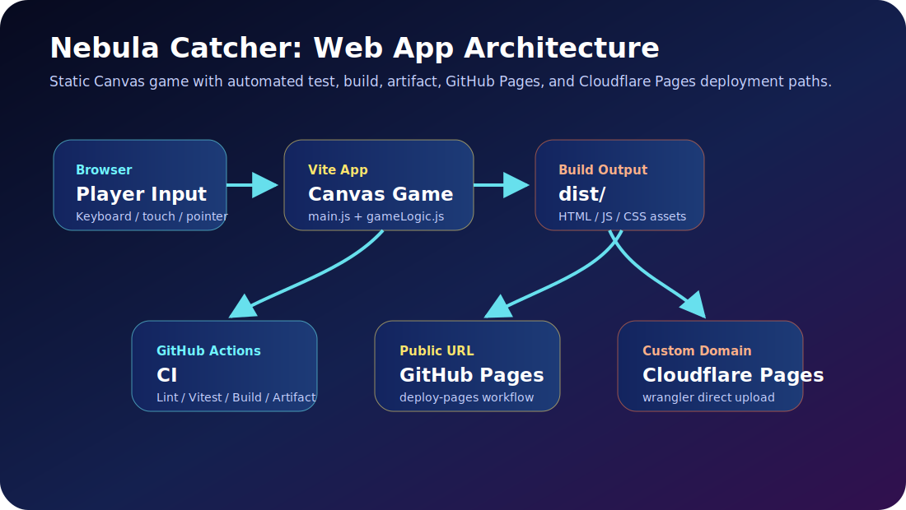
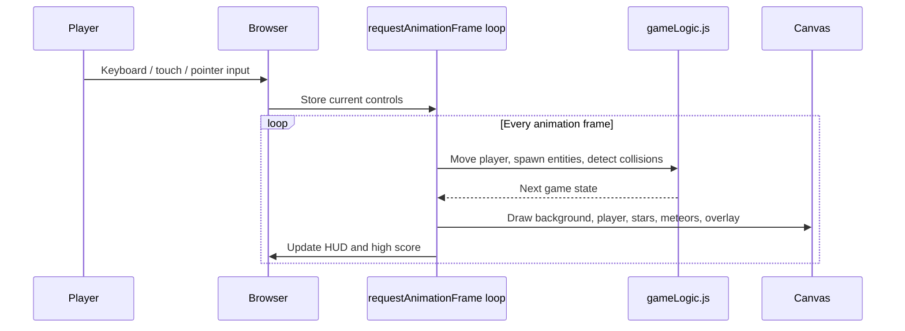
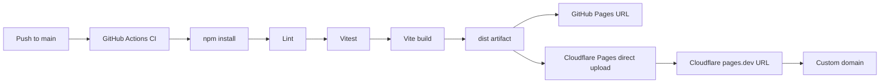

# Architecture

Nebula Catcher is a static browser game. The application has no backend, database, or runtime server requirement, so it can be hosted on GitHub Pages, Cloudflare Pages, or any static hosting service.

## Components

| Layer | Files / service | Responsibility |
| --- | --- | --- |
| Browser UI | `index.html`, `src/styles.css` | Shell, HUD, responsive layout, start/restart controls |
| Game renderer | `src/main.js` | Canvas drawing, keyboard/pointer input, animation loop, high score persistence |
| Game rules | `src/gameLogic.js` | Deterministic game state, movement, spawn timing, collision handling, scoring |
| Tests | `tests/gameLogic.test.js` | Unit tests for movement, collision, RNG, difficulty, formatting |
| CI | `.github/workflows/ci.yml` | Install, lint, test, build, upload `dist` artifact |
| GitHub Pages | `.github/workflows/pages.yml` | Build and deploy `dist` using GitHub Pages Actions |
| Cloudflare Pages | `.github/workflows/cloudflare-pages.yml` | Manual Direct Upload deployment with Wrangler after secrets are configured |

## Request and rendering flow

## Deployment flow

## Production requirements

- Node.js 20 for build and test jobs.
- Static hosting target that can serve the generated `dist/` directory.
- GitHub Pages can publish with `.github/workflows/pages.yml` after Pages is enabled for GitHub Actions.
- Cloudflare Pages deployment requires `CLOUDFLARE_ACCOUNT_ID` and `CLOUDFLARE_API_TOKEN` as GitHub Actions Secrets, plus `CLOUDFLARE_PROJECT_NAME` as a GitHub Actions Variable.
- A Cloudflare-managed DNS zone is needed to attach an owned custom domain to the Pages project.

## Security and operations

- No user data is sent to a server.
- High score is stored only in browser `localStorage`.
- Static response headers are defined in `public/_headers` for Cloudflare Pages.
- The Cloudflare API token is never committed; it must be stored as a GitHub Actions Secret.
